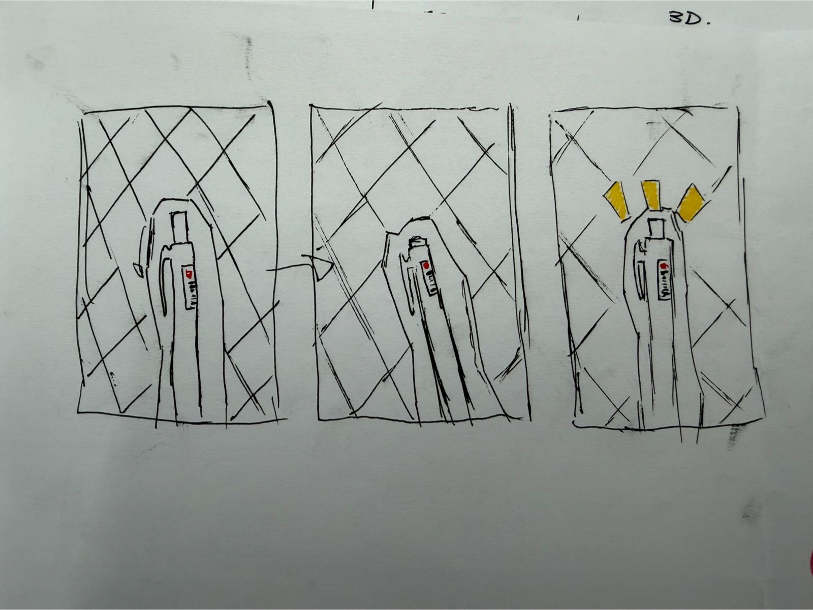
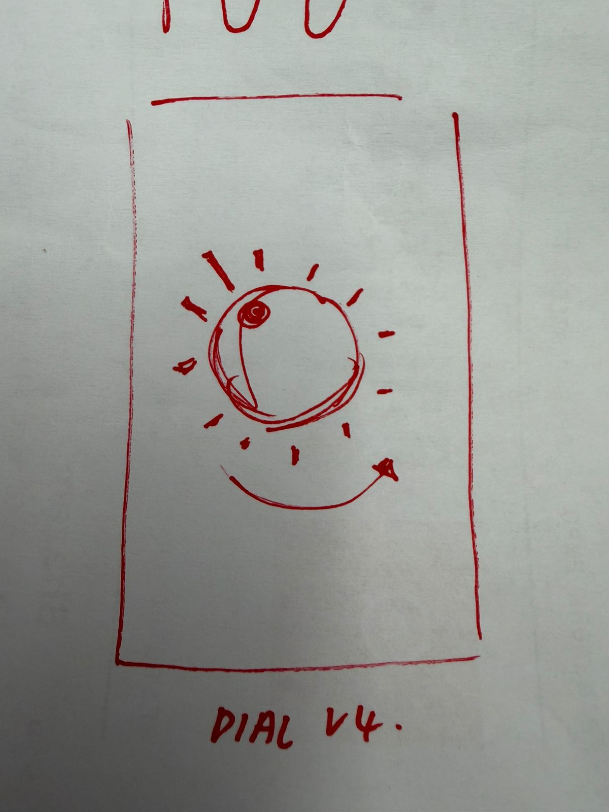
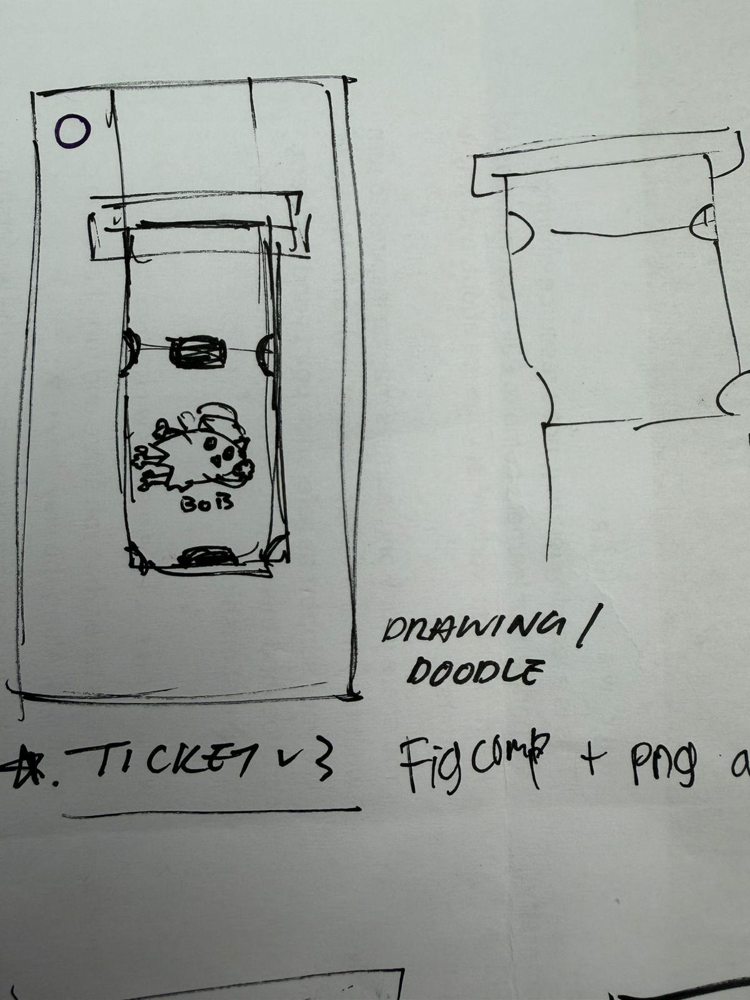
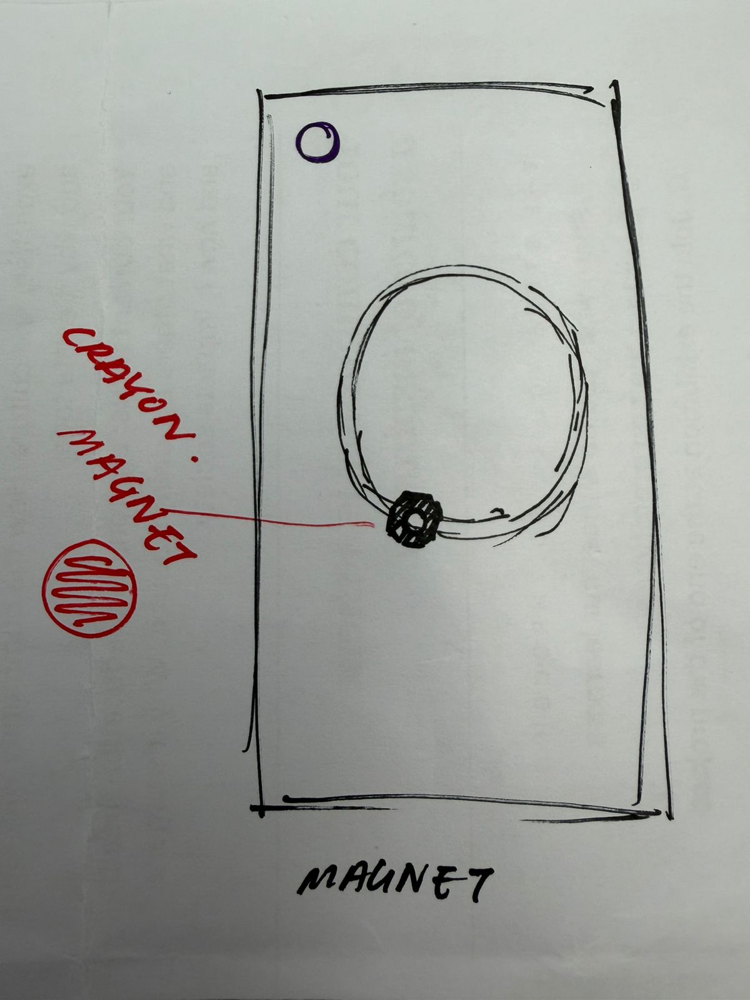
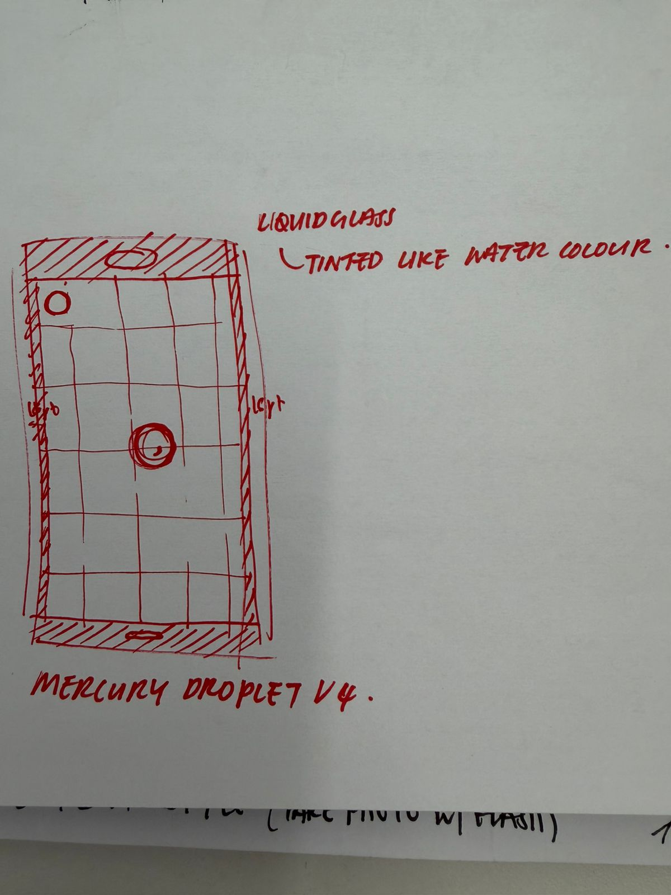

# Hapticle - Design Document (DD)

Hapticle is a neumorphic fidget application built for **Challenge 4 of the Apple Developer Academy (ADA)**. The core objective of the challenge is to explore, learn, and implement native iOS frameworks. Hapticle specifically focuses on **CoreHaptics** (vibrations and haptic feedback) and **AudioToolbox** (audio feedback and sound synthesis) to create a highly tactile, playful, and responsive fidget experience.

---

## 1. Visual & Interaction Style (Neumorphism)

Hapticle implements a modern **Neumorphic (soft 3D)** user interface. The UI elements appear to be extruded from or recessed into the background, simulating real-world plastic, rubber, and metal surfaces, utilizing soft shadows and highlights instead of flat elements or mixed-media textures.

### Color Palette Specification

| Color Name | Preview | HEX | RGBA | HSL |
| :--- | :---: | :--- | :--- | :--- |
| **Grey Shadow** |  | `#000000` | `rgba(0, 0, 0, 1.00)` | `hsl(0, 0%, 0%)` |
| **Primary Grey** |  | `#454545` | `rgba(69, 69, 69, 1.00)` | `hsl(0, 0%, 27%)` |
| **Grey Highlight** |  | `#D9D9D9` | `rgba(217, 217, 217, 1.00)` | `hsl(0, 0%, 85%)` |
| **White Highlight** |  | `#FFFFFF` | `rgba(255, 255, 255, 1.00)` | `hsl(0, 0%, 100%)` |
| **Red Shadow** |  | `#892424` | `rgba(137, 36, 36, 1.00)` | `hsl(0, 58%, 34%)` |
| **Primary Red** |  | `#C73535` | `rgba(199, 53, 53, 1.00)` | `hsl(0, 58%, 49%)` |
| **Red Highlight** |  | `#D86E6E` | `rgba(216, 110, 110, 1.00)` | `hsl(0, 58%, 64%)` |
| **White** |  | `#E0E5EC` | `rgba(224, 229, 236, 1.00)` | `hsl(215, 24%, 90%)` |
| **White Shadow** |  | `#A3B1C6` | `rgba(163, 177, 198, 1.00)` | `hsl(216, 23%, 71%)` |

### Neumorphic Theme Tokens

| Neumorphic Role | White Theme (Light Mode) | Grey Theme (Dark Mode) | Red Theme (Active/Accent) | Description |
| :--- | :--- | :--- | :--- | :--- |
| **Base / Background** |  `White` (`#E0E5EC`) |  `Primary Grey` (`#454545`) |  `Primary Red` (`#C73535`) | Base surface canvas; all neumorphic extrusions blend into this. |
| **Highlight (Light)** |  `White Highlight` (`#FFFFFF`) |  `Grey Highlight` (`#D9D9D9`) |  `Red Highlight` (`#D86E6E`) | Simulates reflected light on the top-left edges of components. |
| **Shadow (Dark)** |  `White Shadow` (`#A3B1C6`) |  `Grey Shadow` (`#000000`) |  `Red Shadow` (`#892424`) | Simulates cast shadow on the bottom-right edges of components. |

---

## 2. Fidget Interactivity & Design Specifications

### 2.1 The Pen (Retractable Ballpoint Fidget)

The Pen fidget simulates the tactile pleasure of clicking a real retractable ballpoint pen. It uses neumorphically rendered vector shapes (using extrusion and recess shadows) and depth-based movement animations combined with custom haptic transients.

*   **Visual Representation:** Rendered programmatically using Neumorphic styling:
    1.  **Outer Barrel:** An extruded vertical capsule blending into the background.
    2.  **Inner Well:** A recessed circular area at the top of the barrel representing the button track.
    3.  **Interactive Button:** A small circular button that sits inside the well, appearing extruded in its unclicked/extended state and recessed in its clicked/depressed state.
*   **Animations:**
    *   Smooth depth transitions (shifting shadow offsets and blur radii) based on interaction state.
    *   Subtle vertical offset displacement (spring-back motion) on release.
*   **Interaction Model:**
    *   **Physical Buttons:** Can be interacted with via the iPhone's physical Volume buttons.
    *   **On-Screen Interaction:** Playable by tapping/pressing the pen sprite on-screen.
    *   **Latch Logic:** Long presses do *not* trigger the latch. The latch only engages when a long press is released.
    *   **Click Sensations:**
        *   While pressing down (screen/button down): Only *one* click is felt.
        *   Upon letting go (screen/button up): *Another* click is felt.
        *   Quick Taps: Two fast clicks are felt in rapid succession.

---

### 2.2 The Dial (Rotary Inertial Fidget)

The Dial simulates a heavy, physical rotary dial (like a safe dial or volume knob) featuring moment of inertia, angular momentum, and physical detents.

*   **Interaction Model:**
    *   Rotated via drag gesture on-screen.
    *   **Leverage / Fulcrum Physics:** Rotational torque varies based on the distance of the finger from the center (fulcrum). If the finger is in the center, leverage is zero and the dial cannot be spun. The further out the finger is, the higher the leverage and the easier it is to spin.
    *   **Momentum:** Flipping the finger adds angular momentum. The dial continues spinning and slows down gradually due to simulated friction.
*   **Haptic Design:**
    *   Vibrations are triggered as the dial crosses angular "detents" (ticks).
    *   Detent frequency increases with rotation speed.
*   **Audio Design:**
    *   Sound pitch and volume are dynamically modulated based on the RPM (Revolutions Per Minute).
    *   Faster RPM results in a higher pitch, mimicking a mechanical whirr or clicking ratchet.

---

### 2.3 The Ticket (Tear-Off Arcade Fidget)

The Ticket simulates the satisfying feeling of tearing a perforated cardboard arcade ticket.

*   **Visual Representation:**
    *   A neumorphic card that appears extruded from the background canvas.
    *   Perforation lines represented by a series of small, evenly-spaced recessed circular slots.
    *   Tear-off animation separating the bottom ticket from the top sheet using physical distance offset.
*   **Interaction Model:**
    *   The user drags the ticket downward to rip it along a perforated line.
    *   As the ticket is pulled, the tension increases.
    *   Once a ticket is completely torn off, the ticket sheet shifts down, generating a new ticket.
*   **Haptic Design:**
    *   Simulates the sequential tearing of paper fibers ("dud dud dud dud dud dud").
    *   Provides a strong snap haptic at the moment of final separation.
*   **Audio Design:**
    *   A ripping sound effect synthesized dynamically or pitched according to the speed of the tear.

---

### 2.4 The Magnet (MagSafe & Field Physics Fidget)

The Magnet simulates playing with magnets, mimicking the MagSafe ring on the back of an iPhone. It features a ring of fixed magnets and a free-floating magnet that follows the finger.

*   **Visual Representation:**
    *   A neumorphically styled circular puck (free magnet) and a series of recessed/extruded circular nodes arranged in a ring (fixed poles) to simulate polarity.
    *   Visual field lines or ripple effects showing magnetic pull.
*   **Interaction Model:**
    *   The user drags a free magnet near a fixed circular ring of magnets.
    *   **Elastic Pull:** The magnet doesn't stick perfectly to the finger; it acts as if attached by an elastic spring, lagging behind to convey mass and "force".
    *   **Snap-to-Ring:** When close to the ring, the magnet snaps to the nearest magnetic node.
    *   **Orbiting & Push-Pull:**
        *   If pulled with enough velocity/force, it breaks free of the snap.
        *   If moved with low force, it orbits the ring.
        *   The ring contains alternating poles (N/S), creating alternating push and pull forces (Coulomb's Law) as the magnet moves around it.
*   **Haptic Design:**
    *   Continuous hum haptic that scales with magnetic force/tension.
    *   Transient snaps when locking onto a magnetic node.
    *   Repulsive pushback felt via high-frequency micro-haptics when passing repulsive poles.

---

### 2.5 The Blob (Elastic Viscous Fidget)

The Blob is a squishy, jelly-like creature centered on a grid background.

*   **Visual Representation:**
    *   A deformable vector blob rendered with soft neumorphic highlights and shadows to give it a 3D organic quality.
    *   Grid background that warps slightly to show gravitational/viscous pull.
*   **Interaction Model:**
    *   The user drags any part of the blob to stretch it.
    *   **Mitosis Mechanism:** If stretched past a critical threshold length, the blob undergoes mitosis and splits into two independent blobs.
    *   The two separate blobs can eventually merge back if they touch.
*   **Haptic Design:**
    *   Squishy, rubbery, low-frequency rumble that increases in amplitude as the blob stretches.
    *   A clean pop/suction transient when the blob splits or merges.
*   **Audio Design:**
    *   Squelching audio effects pitch-shifted during stretching.
    *   A satisfying "pop" sound effect upon division.

