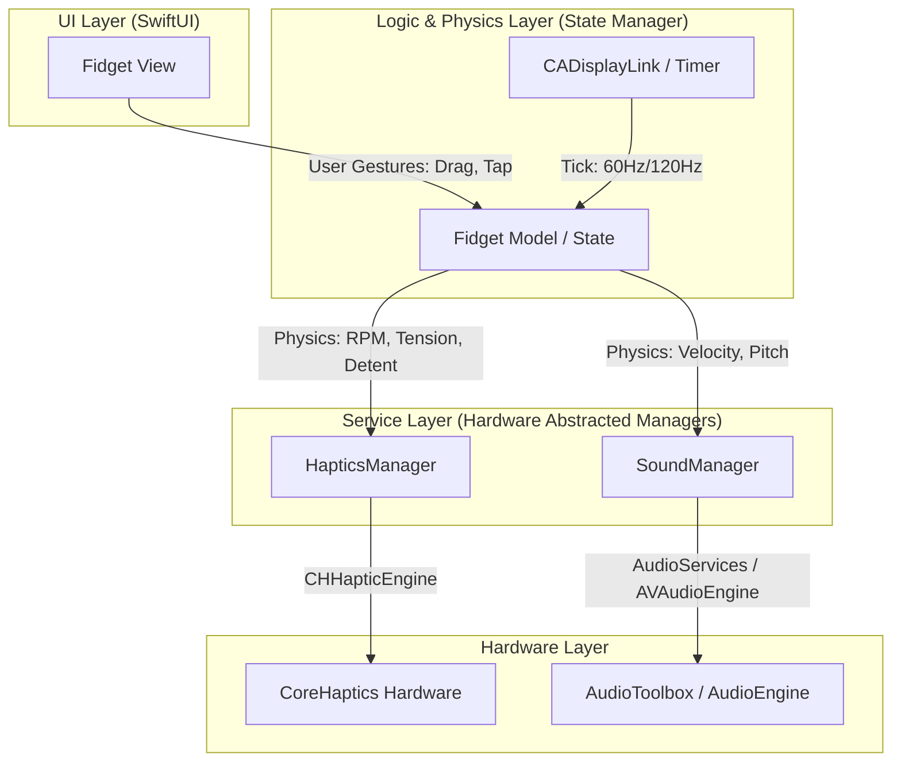
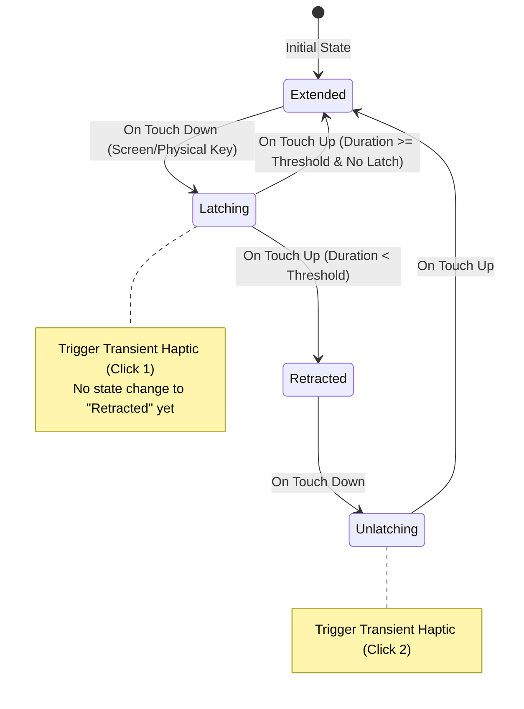

# Hapticle - Technical Design Document (TDD)

This document outlines the technical architecture, physics systems, haptic/audio configurations, and SwiftUI implementation guidelines for **Hapticle**. It is written specifically as a blueprint for the engineering team.

---

## 1. System Architecture

Hapticle is built on a modular, state-driven architecture that separates the user interface, physical physics simulation, and raw hardware feedback engines. It utilizes a **Model-View-ViewModel-Manager (MVVM-M)** design pattern.



---

### 1.1 Directory & Architecture Layers

The code is organized into two primary layers under the main `Hapticle/` directory:

1.  **`Fidgets/` Directory:** Contains feature-specific folders (e.g., `Pen/`, `Dial/`, `Magnet/`, `Ticket/`, `Blob/`).
    *   **`<FidgetName>View.swift`**: Responsible solely for UI rendering and layout. It handles neumorphic styling, displays visual sprites, and intercepts user gesture inputs (such as `DragGesture`, `LongPressGesture`, `TapGesture`).
    *   **`<FidgetName>Model.swift`**: Serves as the state manager (ViewModel). It conforms to `ObservableObject` (or `@Observable` in Swift 5.9+) and tracks the physical quantities (coordinates, velocity, angular momentum, spring tension). It calculates the math behind the movement, checks bounds, and detects threshold triggers (such as crossing a dial tick or breaking a ticket perforation).
2.  **`Managers/` Directory:** System-wide services providing unified hardware access.
    *   **`HapticsManager.swift`**: Manages the lifecycle of `CHHapticEngine`. It abstracts high-level haptic behaviors (like transients, continuous rumbles, and custom patterns) so that individual Fidget Models do not interface with CoreHaptics directly.
    *   **`SoundManager.swift`**: Manages sound synthesis and audio playback. It handles rapid system sounds via `AudioServicesPlaySystemSound` and continuous pitch shifting via `AVAudioEngine` for inertial physics (e.g., dial spinning).

---

### 1.2 Execution & Data Flow

When a user interacts with any Fidget, the data flows sequentially:

1.  **Interaction Phase:** The user touches the screen. The `View` captures the gesture coordinates and passes the location, velocity, and state (began, changed, ended) to the `Model`.
2.  **Simulation Phase:**
    *   *For instantaneous actions (e.g., Pen click)*: The `Model` immediately evaluates the state transitions (e.g. `unclicked` -> `latching`) and requests a haptic click.
    *   *For continuous physics (e.g., Dial momentum, Magnet spring, Blob stretch)*: The `Model` runs a physical simulation. If the interaction involves continuous momentum (such as a spinning dial after the user lets go), a `CADisplayLink` updates the physics simulation at the device's native refresh rate (60Hz or 120Hz), calculating friction decay, speed, and force output.
3.  **Hardware Dispatch Phase:** The `Model` evaluates variables from the simulation:
    *   If a discrete boundary or detent is crossed, it calls `HapticsManager.shared.playClick(intensity:sharpness:)`.
    *   If a variable changes continuously (such as Dial RPM), it dynamically calls `SoundManager.shared.setPitch(forRPM:)` to modulate the frequency of the sound synthesizer.

---

### 1.3 Step-by-Step Developer Guide: Adding a Fidget

When building a new fidget or implementing one of the empty placeholders:

#### Step 1: Implement the State & Physics Model
Create the model class in `<FidgetName>Model.swift` to house state variables and calculate mechanical motion:
```swift
import Foundation
import Combine

class DialModel: ObservableObject {
    // 1. Published state variables that the View observes
    @Published var rotationAngle: Double = 0.0
    @Published var angularVelocity: Double = 0.0
    @Published var isDragging: Bool = false
    
    private var lastTickAngle: Double = 0.0
    private var displayLink: CADisplayLink?
    
    // 2. Methods to calculate interactions
    func handleDrag(offset: CGPoint, velocity: CGPoint, center: CGPoint) {
        // Calculate physics formulas (leverage, torque, angular speed)
        // Check for detents
        let currentTick = floor(rotationAngle / 15.0) // 15-degree increments
        if currentTick != lastTickAngle {
            // Trigger feedback
            HapticsManager.shared.playClick(intensity: 0.6, sharpness: 0.8)
            SoundManager.shared.playSystemClick()
            lastTickAngle = currentTick
        }
    }
}
```

#### Step 2: Implement the SwiftUI View
Create the view in `<FidgetName>View.swift`. Bind the Model and capture gestures:
```swift
import SwiftUI

struct DialView: View {
    // Bind the observed state
    @StateObject private var model = DialModel()
    
    var body: some View {
        GeometryReader { geometry in
            let center = CGPoint(x: geometry.size.width / 2, y: geometry.size.height / 2)
            
            VStack {
                // Render neumorphic Dial image/vector
                Circle()
                    .modifier(NeumorphicExtrusionModifier(isPressed: model.isDragging))
                    .rotationEffect(.degrees(model.rotationAngle))
                    .gesture(
                        DragGesture(minimumDistance: 0)
                            .onChanged { value in
                                model.isDragging = true
                                model.handleDrag(
                                    offset: value.location,
                                    velocity: value.velocity,
                                    center: center
                                )
                            }
                            .onEnded { _ in
                                model.isDragging = false
                                // Start inertial simulation...
                            }
                    )
            }
        }
    }
}
```

#### Step 3: Integrate with Shared Managers
Configure the hardware actions in `HapticsManager` and `SoundManager` if you require custom haptic waveforms or sound clips. This decouples hardware configuration details from the visual layouts.

---

## 2. Core Physics & Mathematical Formulations

To ensure fidgeting feels tactile and realistic, we implement numerical physics models rather than static animations.

### 2.1 The Dial (Rotary Friction & Leverage)

The dial rotates about a center point $\mathbf{C} = (x\_c, y\_c)$. 
When a drag gesture is detected at point $\mathbf{P} = (x, y)$, we calculate:

1.  **Radius / Leverage Vector:**
```math
\mathbf{r} = \mathbf{P} - \mathbf{C}
```
```math
r = \|\mathbf{r}\| = \sqrt{(x - x_c)^2 + (y - y_c)^2}
```

2.  **Torque Multiplier ($M\_t$):**
    If the drag occurs too close to the center, leverage is zero:
```math
M_t = \begin{cases} 0 & \text{if } r < R_{min} \\ \frac{r - R_{min}}{R_{max} - R_{min}} & \text{if } R_{min} \le r \le R_{max} \\ 1 & \text{if } r > R_{max} \end{cases}
```

3.  **Angular Momentum & Friction Decay:**
    When the finger is released, we model rotation using angular inertia $I$ and friction coefficient $\mu$:
```math
\theta_{t+1} = \theta_t + \omega_t \Delta t
```
```math
\omega_{t+1} = \omega_t \cdot (1 - \mu M_t)
```

4.  **Detent Calculation:**
    If $k\_t \neq k\_{t-1}$, trigger a haptic tick.
    Vibrations are triggered when the angle crosses steps of size $\Delta\theta\_{detent}$:
```math
k = \lfloor \frac{\theta}{\Delta\theta_{detent}} \rfloor
```


5.  **Audio Pitch Modulation:**
    Sound frequency $f$ is proportional to current RPM (angular velocity $\omega$):
```math
f(\omega) = f_{base} + k_{rpm} \cdot |\omega|
```

---

### 2.2 The Ticket (Perforation Shear Force)

The ticket is pulled down along the $y$-axis. The tear resistance is modeled as a series of physical fiber thresholds.

1.  **Elastic Resistance Force ($F\_{res}$):**
    As the ticket is pulled downwards by displacement $y$, we model the tension force:
```math
F_{res} = k_{elastic} \cdot y
```

2.  **Perforation Micro-snaps:**
    Let $N$ be the number of perforations spaced at interval $d$. As $y$ increases:
    *   Whenever $y$ crosses $m \cdot d$ (where $m = 1 \dots N$):
        *   Instantly drop $F\_{res}$ by a fraction to simulate a fiber snapping.
        *   Trigger a sharp, low-intensity transient haptic: "dud".
3.  **Tear Completion:**
    When $y > Y\_{tear\_threshold}$, the ticket breaks free. The force drops to zero, a strong release haptic is triggered, and a layout offset animation triggers to feed the next ticket.

---

### 2.3 The Magnet (Coulomb's Law & MagSafe Orbitals)

The system models a free magnet at $\mathbf{P}\_m = (x\_m, y\_m)$ and $K$ fixed magnetic poles arranged in a circle of radius $R\_{ring}$ at coordinates $\mathbf{P}\_{fixed, i}$.

1.  **Finger Elastic Connection (Spring Force):**
```math
\mathbf{F}_{spring} = -k_{spring} \cdot (\mathbf{P}_m - \mathbf{P}_{finger})
```

2.  **Magnetic Forces (Coulomb's Law Approximation):**
    Each pole $i$ has charge $q\_i \in \{-1, 1\}$ representing Alternating North/South poles:
```math
\mathbf{F}_{mag, i} = C_{coulomb} \cdot \frac{q_{free} \cdot q_i}{\|\mathbf{P}_m - \mathbf{P}_{fixed, i}\|^2 + \epsilon} \cdot \frac{\mathbf{P}_{fixed, i} - \mathbf{P}_m}{\|\mathbf{P}_{fixed, i} - \mathbf{P}_m\|}
```
```math
\mathbf{F}_{net} = \mathbf{F}_{spring} + \sum_{i=1}^K \mathbf{F}_{mag, i} - c_{damping} \cdot \mathbf{v}_m
```

3.  **Lock & Escape States:**
    *   **Snap (Orbit Lock):** If distance $d\_i = \|\mathbf{P}\_m - \mathbf{P}\_{fixed, i}\| < D_{snap}$, the free magnet is locked to node $i$.
    *   **Breakaway:** The user must pull their finger away until the spring tension exceeds the magnetic pull:
```math
\|\mathbf{F}_{spring}\| > \|\mathbf{F}_{mag, i}\|
```

---

### 2.4 The Blob (Mitosis & Squelch)

A soft-body representation is simulated using simple radial points or center-of-mass stretching.

1.  **Tension Metric ($T$):**
```math
T = \|\mathbf{P}_{finger} - \mathbf{P}_{anchor}\|
```

2.  **Mitosis Trigger:**
    *   Trigger high-energy, low-sharpness haptic (viscous pop).
    *   If $T > T\_{max}$, split the blob into two blobs at centroids:
```math
\mathbf{C}_1 = \mathbf{P}_{anchor} + \frac{\mathbf{r}}{4}, \quad \mathbf{C}_2 = \mathbf{P}_{finger} - \frac{\mathbf{r}}{4}
```


---

## 3. Fidget-Specific State Machines

### 3.1 Retractable Pen Latch Logic

The pen requires non-linear latch logic to prevent "clicking" under continuous pressure.



*   **Latch Constraint:** If the user presses down and holds (`Long Press`), the state remains in `Latching` or `Unlatching`. The physical click latch occurs only upon **release** (`TouchUp`).
*   **Rapid Tap:** If the touch duration is $< 0.15$ seconds, the state toggles immediately and fires both haptics in quick succession.

---

## 4. CoreHaptics & AudioToolbox Integration

### 4.1 Haptics Engine Wrapper

Below is the Swift implementation blueprint for establishing the `CHHapticEngine` and playing transient clicks dynamically:

```swift
import CoreHaptics
import Foundation

class FidgetHapticEngine {
    private var hapticEngine: CHHapticEngine?
    
    init() {
        createEngine()
    }
    
    private func createEngine() {
        guard CHHapticEngine.capabilitiesForHardware().supportsHaptics else { return }
        do {
            hapticEngine = try CHHapticEngine()
            try hapticEngine?.start()
            
            hapticEngine?.stoppedHandler = { reason in
                print("Haptic engine stopped: \(reason)")
            }
            
            hapticEngine?.resetHandler = { [weak self] in
                print("Haptic engine reset required")
                try? self?.hapticEngine?.start()
            }
        } catch {
            print("Failed to start haptic engine: \(error.localizedDescription)")
        }
    }
    
    func playClick(intensity: Float, sharpness: Float) {
        guard let engine = hapticEngine else { return }
        
        let intensityParam = CHHapticEventParameter(parameterID: .hapticIntensity, value: intensity)
        let sharpnessParam = CHHapticEventParameter(parameterID: .hapticSharpness, value: sharpness)
        
        let event = CHHapticEvent(
            eventType: .hapticTransient,
            parameters: [intensityParam, sharpnessParam],
            relativeTime: 0
        )
        
        do {
            let pattern = try CHHapticPattern(events: [event], parameters: [])
            let player = try engine.makePlayer(with: pattern)
            try player.start(atTime: CHHapticTimeImmediate)
        } catch {
            print("Failed to play haptic: \(error.localizedDescription)")
        }
    }
    
    func playContinuousHaptic(intensity: Float, sharpness: Float, duration: TimeInterval) {
        guard let engine = hapticEngine else { return }
        
        let intensityParam = CHHapticEventParameter(parameterID: .hapticIntensity, value: intensity)
        let sharpnessParam = CHHapticEventParameter(parameterID: .hapticSharpness, value: sharpness)
        
        let event = CHHapticEvent(
            eventType: .hapticContinuous,
            parameters: [intensityParam, sharpnessParam],
            relativeTime: 0,
            duration: duration
        )
        
        do {
            let pattern = try CHHapticPattern(events: [event], parameters: [])
            let player = try engine.makePlayer(with: pattern)
            try player.start(atTime: CHHapticTimeImmediate)
        } catch {
            print("Continuous haptic failed: \(error.localizedDescription)")
        }
    }
}
```

### 4.2 Audio Synthesis Framework

Audio synthesis is implemented using `AudioToolbox`'s system sound mechanisms for rapid response times, and `AVFoundation`'s `AVAudioEngine` with pitch scaling nodes for dynamic assets (e.g., Dial RPM sound).

```swift
import AudioToolbox
import AVFoundation

class FidgetSoundManager {
    private var audioEngine: AVAudioEngine?
    private var playerNode: AVAudioPlayerNode?
    private var pitchNode: AVAudioUnitTimePitch?
    
    init() {
        setupInertialEngine()
    }
    
    private func setupInertialEngine() {
        audioEngine = AVAudioEngine()
        playerNode = AVAudioPlayerNode()
        pitchNode = AVAudioUnitTimePitch()
        
        guard let engine = audioEngine, let player = playerNode, let pitch = pitchNode else { return }
        
        engine.attach(player)
        engine.attach(pitch)
        
        engine.connect(player, to: pitch, format: nil)
        engine.connect(pitch, to: engine.mainMixerNode, format: nil)
        
        try? engine.start()
    }
    
    func setPitch(forRPM rpm: Float) {
        // Adjust speed/pitch factor based on physics engine inputs
        let basePitch = 1.0 // Normal rate
        let newPitch = basePitch + (rpm * 0.1) // 100 cents per unit speed increase
        pitchNode?.pitch = Float(max(-2400.0, min(2400.0, newPitch)))
    }
    
    func playSystemClick() {
        // System Sound ID 1104 is a standard clean keyboard tap click
        AudioServicesPlaySystemSound(1104)
    }
}
```

---

## 5. Neumorphic Style System (SwiftUI Implementation)

To construct the light and dark visual framework specified in the DD:

```swift
import SwiftUI

extension Color {
    static let neumorphicLightBackground = Color(hex: "#E0E5EC")
    static let neumorphicLightHighlight = Color(hex: "#FFFFFF")
    static let neumorphicLightShadow = Color(hex: "#A3B1C6")
    
    static let neumorphicDarkBackground = Color(hex: "#454545")
    static let neumorphicDarkHighlight = Color(hex: "#D9D9D9")
    static let neumorphicDarkShadow = Color(hex: "#2B2B2B")
}

struct NeumorphicExtrusionModifier: ViewModifier {
    @Environment(\.colorScheme) var colorScheme
    var isPressed: Bool = false
    
    func body(content: Content) -> some View {
        let background = colorScheme == .dark ? Color.neumorphicDarkBackground : Color.neumorphicLightBackground
        let highlight = colorScheme == .dark ? Color.neumorphicDarkHighlight : Color.neumorphicLightHighlight
        let shadow = colorScheme == .dark ? Color.neumorphicDarkShadow : Color.neumorphicLightShadow
        
        if isPressed {
            content
                .background(background)
                .overlay(
                    RoundedRectangle(cornerRadius: 16)
                        .stroke(shadow, lineWidth: 4)
                        .blur(radius: 4)
                        .offset(x: 2, y: 2)
                        .mask(RoundedRectangle(cornerRadius: 16).fill(LinearGradient(colors: [shadow, Color.clear], startPoint: .topLeading, endPoint: .bottomTrailing)))
                )
                .overlay(
                    RoundedRectangle(cornerRadius: 16)
                        .stroke(highlight, lineWidth: 4)
                        .blur(radius: 4)
                        .offset(x: -2, y: -2)
                        .mask(RoundedRectangle(cornerRadius: 16).fill(LinearGradient(colors: [Color.clear, highlight], startPoint: .topLeading, endPoint: .bottomTrailing)))
                )
        } else {
            content
                .background(background)
                .shadow(color: shadow, radius: 8, x: 6, y: 6)
                .shadow(color: highlight, radius: 8, x: -6, y: -6)
        }
    }
}
```

---

## 6. Git & Branch Naming Conventions

To maintain a clean and structured commit history, all team members must adhere to the following branch naming conventions:

### Branch Name Format
```
type/name/short-description
```

*   **`type/`**: The category of work being performed. Must be one of the following:
    *   `feat/` - For building new logic or features (e.g., hooking up the database).
    *   `ui/` - For building visual SwiftUI screens with mock data.
    *   `fix/` - For fixing a bug.
    *   `chore/` - For project maintenance (updating packages, adding assets).
    *   `testing/` - For writing or updating tests.
*   **`name/`**: The developer's name or handle in lowercase (e.g., `reno`, `cho`).
*   **`short-description`**: A brief explanation of the branch scope. **MUST** be written in **kebab-case** (all lowercase, words separated by hyphens).

### Examples
*   `feat/reno/core-haptics-engine`
*   `ui/cho/pen-view-mockup`
*   `fix/reno/dial-inertial-decay`
*   `chore/cho/add-arcade-ticket-assets`
*   `testing/reno/blob-mitosis-tests`

