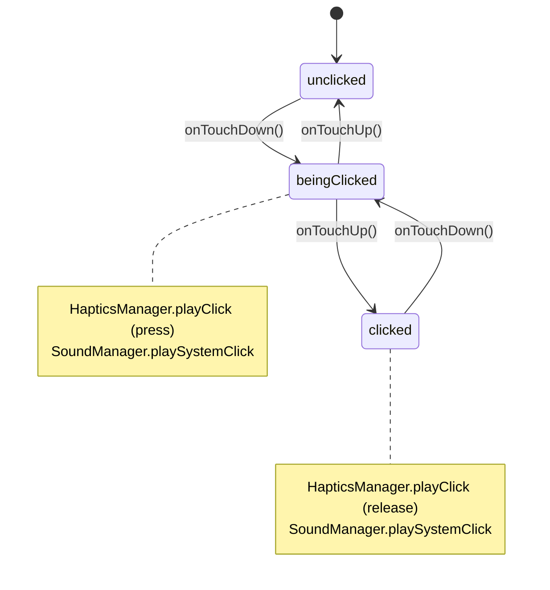

# Hapticle Pen Fidget Specification (Pen.md)

This log documents the technical architecture and implementation details of the **Pen fidget**, located under `Hapticle/Fidgets/Pen/`. It covers the state machine, visual/offset mapping, physics-to-haptics estimation, and known deviations from the general Fidget architecture described in the Hapticle TDD.

---

## 1. Overview

The Pen fidget renders a neumorphic pen illustration composed of five layered vector/raster assets and exposes one interactive element: a clickable button (`Vector 3`) that toggles between an extended and retracted resting state, similar to a physical retractable pen's latch mechanism.

Per the TDD's MVVM-M pattern (§1.1), responsibilities are split as follows:

| File | Role |
| :--- | :--- |
| `PenModel.swift` | State manager (ViewModel). Owns `PenButtonState`, offset math, and dispatches haptic/audio feedback. Contains zero SwiftUI code. |
| `PenView.swift` | UI rendering only. Composes the five image layers, applies neumorphic shadow styling, and forwards raw gesture data to `PenModel`. Contains zero state or physics logic. |

> **Naming note:** the model file was originally named `PenDial.swift` despite declaring `PenModel`/`PenButtonState` with no Dial-related content. Per TDD §1.1's `<FidgetName>Model.swift` convention, this should be renamed to `PenModel.swift`.

---

## 2. State Machine

### 2.1 States

The Pen button uses a **3-state machine**, which is a simplification of the general 4-state latch pattern described in TDD §3.1 (`Extended → Latching → Retracted → Unlatching → Extended`). The two "in-transit" states (`Latching`/`Unlatching`) are collapsed into a single `beingClicked` state, since both look visually identical (fully pressed in) regardless of which direction the toggle is about to resolve.



| State | Description | Visual Offset |
| :--- | :--- | :--- |
| `unclicked` | Fully extended, at rest. | 0pt |
| `beingClicked` | Finger down, button fully pressed in. Transient — always resolves on release. | 50pt |
| `clicked` | Toggled "locked in" resting state. | 30pt |

### 2.2 Toggle Resolution Logic

Because `beingClicked` overwrites the prior resting state, `PenModel` snapshots it into `preClickState` at the moment a press begins. On release, the button resolves to the *opposite* resting state from whatever `preClickState` was:

```swift
buttonState = (preClickState == .clicked) ? .unclicked : .clicked
```

This produces the toggle loop:

```
unclicked → (press) → beingClicked → (release) → clicked
clicked   → (press) → beingClicked → (release) → unclicked
```

---

## 3. Physics-Driven Haptic & Audio Feedback

### 3.1 Hardware Constraint: No Force/Pressure Sensing

3D Touch (`UITouch.force`) was discontinued after the iPhone XS/XS Max (2018) and replaced by Haptic Touch (duration-based, no pressure data) starting with the iPhone 11 generation. **Neither of the project's target devices — iPhone 14 Pro Max nor iPhone 17 — support force-sensitive touch.** As a result, `PenModel` cannot use touch pressure as an input signal under any code path; gesture **velocity** and **press duration** are used as the closest available physical proxies for "how hard" a press or release was.

### 3.2 Press (`onTouchDown`)

Vertical drag velocity (`DragGesture.Value.velocity.height`, px/s) is normalized to a `0...1` "speed" factor and mapped onto CoreHaptics' continuous `intensity`/`sharpness` parameters:

```math
speed = \min\left(\frac{|velocity_y|}{400}, 1.0\right)
```
```math
intensity = 0.3 + (speed \times 0.7) \quad \text{→ ranges 0.3 (soft tap) to 1.0 (slammed)}
```
```math
sharpness = 0.2 + (speed \times 0.8) \quad \text{→ ranges 0.2 (dull) to 1.0 (crisp)}
```

The `400` divisor was tuned empirically — typical finger-tap velocities rarely exceed a few hundred px/s, so a higher divisor (e.g. `1000`) caused most taps to cluster near the floor of the range, making haptic variety barely perceptible.

### 3.3 Release (`onTouchUp`)

Press duration (time between `onTouchDown` and `onTouchUp`) is normalized into a `0...1` "held" factor, and *inversely* scaled — a quick tap-and-release snaps crisply; a long hold-then-release lands softer, matching TDD §4.1's Pen mapping ("slightly lower-sharpness click on release"):

```math
heldFactor = \min\left(\frac{duration}{0.5}, 1.0\right)
```
```math
intensity = 0.8 - (heldFactor \times 0.5) \quad \text{→ ranges 0.3 (long hold) to 0.8 (snap release)}
```
```math
sharpness = 0.7 - (heldFactor \times 0.4) \quad \text{→ ranges 0.3 to 0.7}
```

### 3.4 Dispatch Pattern

Both `onTouchDown` and `onTouchUp` fire a **paired haptic + audio event**, matching the dual-actuator dispatch pattern described in the Managers spec §3:

```swift
HapticsManager.shared.playClick(intensity: ..., sharpness: ...)
SoundManager.shared.playSystemClick()
```

`HapticsManager.playClick` uses `CHHapticEngine` on supported hardware (continuous `intensity`/`sharpness` range) and transparently falls back to bucketed `UIImpactFeedbackGenerator` styles on the Simulator or unsupported devices — see Managers.md §1.2. Because the Simulator fallback only has 3 discrete buckets, **haptic variety tuned via `intensity`/`sharpness` is only meaningfully perceptible on physical hardware.**

### 3.5 Known Limitation: `SoundManager.playSystemClick()` Volume

`playSystemClick()` currently calls `AudioServicesPlaySystemSound(1104)` — the native iOS Digital Crown/selector tick. This API has **no independent volume parameter**; it plays at a fixed level tied to the device's Ringer/Alerts volume, not media volume, and is designed by Apple to be a subtle UI-level tick rather than a prominent effect. If a louder, more deliberate click is needed, this should be replaced with either:
- A custom sample played through `AVAudioPlayerNode` (full gain control), or
- A short procedural burst using the existing oscillator infrastructure in `SoundManager`.

This is an open item, not yet implemented.

---

## 4. Visual Composition (`PenView`)

### 4.1 Layer Stack

Five image layers are composited back-to-front in a single `ZStack`:

| Order | Asset | Notes |
| :--- | :--- | :--- |
| 1 | `Vector 3` | Clickable button; animates `y`-offset per `PenButtonState`. |
| 2 | `Vector 6` | Pen body (static). |
| 3 | `Vector 7` | Crown (static); Z-order overlaps the button's top edge, so the button visually slides behind it as it presses down. |
| 4 | `Vector9PNG` | Pocket clip; flat PNG with shadows pre-baked, unlike the vector layers which reconstruct shadows in code. |
| 5 | `hapticle` | Wordmark text. |

### 4.2 Shadow Reconstruction (`innerShadowShift`)

Figma's SVG export carries shape/path data only — layer effects (drop shadows, inner shadows, blurs) are **not** embedded in the exported vector and must be reconstructed in SwiftUI:

- **Drop shadows** (highlight + shadow pair) use SwiftUI's native `.shadow(color:radius:x:y:)`, applied twice per layer (once per Figma "Drop shadow" effect).
- **Inner shadows** have no SwiftUI native equivalent and are approximated via the custom `innerShadowShift` view modifier: a solid-color duplicate of the shape is blurred as a whole, offset in the shadow's direction, then re-clipped to the original silhouette — so wherever the shifted copy no longer reaches, the original content shows through, mimicking a directional inner shadow falloff.

Figma-to-SwiftUI parameter mapping used throughout:
- Figma `Blur` ≈ 2× SwiftUI `radius` (approximate; some manual tuning was needed per-layer).
- Figma `Spread` has no direct equivalent and is currently unimplemented (all current assets use `Spread: 0`).
- Figma inner shadow `X`/`Y` map directly to `innerShadowShift`'s `x`/`y` parameters.

### 4.3 Hit Testing

`.contentShape(Rectangle())` is applied to the outer `ZStack` before `.gesture(...)`, expanding the tappable region to the entire screen frame rather than only the visible pixels of the button image — so a tap anywhere on screen triggers the press/release cycle, not just direct taps on `Vector 3`.

---

## 5. Deviations from General Fidget Architecture

| TDD Expectation | Pen Implementation | Rationale |
| :--- | :--- | :--- |
| §3.1: 4-state latch machine (`Extended`/`Latching`/`Retracted`/`Unlatching`) | 3-state machine (`unclicked`/`beingClicked`/`clicked`) | `Latching` and `Unlatching` are visually identical (fully pressed); collapsing them removes redundant state without losing any visual or haptic behavior. |
| §3.1: Rapid-tap exception (<0.15s chains both transitions with double haptic fire) | Not implemented | Descoped in favor of the simpler toggle; may be revisited if product wants the rapid-tap behavior back. |
| §2.1 formula 2 (Torque Multiplier via leverage distance from center) | N/A — Pen has no rotational/leverage physics | Only the Dial fidget's physics model applies here; Pen uses discrete press events, not continuous rotation. |
| §1.2: intensity/sharpness "dynamically scaled by collision velocity" | Implemented using `DragGesture` velocity (press) and hold duration (release) as proxies | No force/pressure sensing available on target hardware (§3.1 above); velocity and duration are the closest available physical signals. |

---

## 6. Open Items

- [ ] Rename `PenDial.swift` → `PenModel.swift` per TDD §1.1 convention.
- [ ] Resolve `SoundManager.playSystemClick()` volume limitation (§3.5) — likely requires a custom audio sample.
- [ ] Decide whether the TDD §3.1 rapid-tap exception should be reintroduced.
- [ ] Tune `maxTravel`/offset constants (`50pt`/`30pt`) against final asset dimensions once art is locked.
